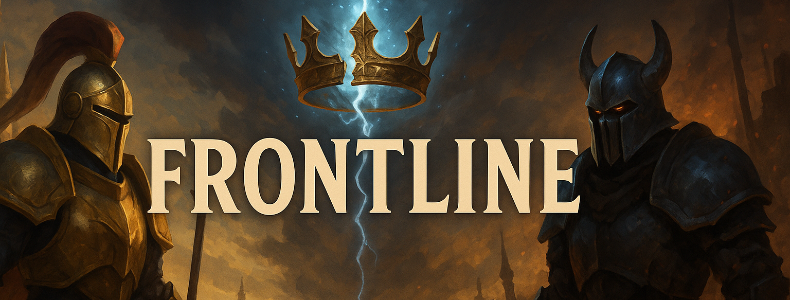

# FRONTLINE 
## Áttekintés
A **Frontline** egy kétjátékos, körökre osztott stratégiai autobattler. A támadó célja a védő kastélyának elfoglalása, míg a védő feladata hét sikeres védelem végrehajtása. A pálya hexagon csempékből áll, a csata automatikusan zajlik.

A projekt Unity alapú. Ez a dokumentáció tartalmazza a játékmenet leírását, a fő rendszereket, a fájlszerkezetet és az assetek elérését.

---

## Tartalomjegyzék
1. Játékmenet összefoglaló  
2. Fő funkciók  
3. Játékszabályok  
4. Mentés / betöltés  
5. Assetek elérése  
6. Projektstruktúra  
7. Futtatás  
8. Verzióinformációk

---

## 1. Játékmenet összefoglaló
A játék maximum **14 körig** tart. Egy kör:

1. Pálya generálása  
2. Egységelhelyezés (max. 20 pont)  
3. Automatikus csata  
4. Pontok frissítése  
5. Győzelmi feltételek vizsgálata

**Győzelem:**
- Támadó: elfoglalja a kastély mezőt  
- A game scene-en belül, ha elfoglaljuk az adott erődöt, ezzel jelezve a World Map-nek, hogy a csata befejeződött, és ez alapján elfoglalják a mezőt
- A nyilakkal lehetőségünk van gyorsítani a játékmenetet, ha a bal nyílra nyomunk a bal oldali játékos nyer, ha a jobb oldalira, akkor pedig a jobb oldali.

---

## 2. Fő funkciók
- Hatszög-alapú pályagenerálás  
- Kétjátékos mód  
- Egységpont-rendszer  
- Játékállás mentése és betöltése (.json)  
- Harci log  
- Körkezelés és győzelmi logika  

---

## 3. Játékszabályok

### Egységek
| Típus        | Költség | Támadás | Élet | Hatótáv |
|--------------|---------|---------|------|---------|
| Közelharcos  | 5       | változó | 5  | 1   |

Egységstatisztikák:  
`Assets/Scripts/Unit.cs`

### Aranyrendszer
- Kör elején: **15 pont**  
- Győztes: Minden pontját + 5-öt visz tovább 
- Vesztes: maradék pontját továbbviszi  

---

## 4. Mentés és betöltés
A mentés JSON formátumú:
`Assets/StreamingAssets/savegame.json`

Mentett adatok:
- kör  
- pálya   
- játékosok pontjai  
- csatatörténet  

---

## 5. Assetek elérése (Unity – kötelező dokumentáció)

### Pálya
`Assets/Hexagons`

`Assets/Prefabs`

`Assets/Scenes`

A pályagenerálás logikája:  
`Assets/Scripts/Map/MapGenerator.cs`

### Grafika / UI
`Assets/Hexagons`

---

## 6. Projektstruktúra

- **📁Assets/**
  - **Hexagons/** – textúrák
  - **Prefabs/** – előre elkészített modellek
  - **Scenes/** – jelenetek, GameScene, WorldMapScene, MainMenu
  - **Scripts/** – az egész program "agya", tartalmazza mindenhez a scriptet
  - **Settings/** - settings, volume sliders, PC/Mobile Renders
  - **Tests/** - edit mode, play mode

---

## 7. Futtatás
`FrontlineV1.exe`

---

## 8. Verzióinformációk
- Játékverzió: 1.0 Alpha  
