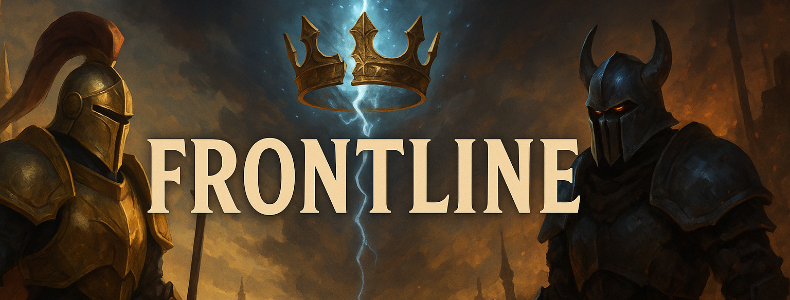

# FRONTLINE – Tactical Autobattler

## 1. Projekt Áttekintése
A **Frontline** egy Unity-ben fejlesztett, körökre osztott stratégiai autobattler játék. A projekt a "Modern szoftverfejlesztési eszközök" tárgy keretében készült, demonstrálva a haladó objektumorientált tervezést, a procedurális tartalomgenerálást és az összetett algoritmusok (pl. A* útvonalkeresés) implementálását hexagonális rácson.

A játékosok egységeket helyeznek el a pályán, majd a csata automatikusan, szimuláció útján zajlik le, ahol a stratégiai pozicionálás és az egységek szinergiája dönt a győzelemről.

---

## 2. Főbb Funkciók
* **Procedurális Pályagenerálás:** Minden játék új, dinamikusan generált hexagonális térképen zajlik, elkülönített "Támadó" (LeftZone) és "Védő" (RightZone) zónákkal.
* **Automatikus Harcrendszer:** A csaták valós időben, de automatizált logikával zajlanak (Auto-battler), ahol az egységek önálló döntéseket hoznak.
* **Mentés és Betöltés (Perzisztencia):** Teljes játékállapot mentése JSON formátumban, verziókövetett fájlnevekkel.
* **Intelligens AI:** Az egységek A* (A-Star) algoritmust használnak az akadályok megkerülésére és a célpontok megközelítésére.

---

## 3. Szoftvertechnológiai Megoldások és Architektúra

A fejlesztés során kiemelt figyelmet fordítottunk a tiszta kódra (Clean Code) és a fenntartható architektúrára.

### 3.1. Tervezési Minták (Design Patterns)
* **Singleton Pattern:** A `BattleManager` és `GameManager` osztályok Singletonként üzemelnek, biztosítva a központi hozzáférést a játék globális állapotához.
* **Data Transfer Object (DTO):** A mentési rendszer (`SaveManager.cs`) elválasztja a futásidejű logikát az adattárolástól. Külön `GameState` és `PlayerState` osztályok felelnek a szerializációért.
* **Component-Based & Data-Driven Design:** Az egységek (`Unit.cs`) rugalmas, paraméterezhető komponensként működnek. Az eltérő egységtípusok (pl. Íjász vs. Közelharcos) viselkedését nem öröklődéssel, hanem adatvezérelt módon (Data-Driven), a `unitModelPrefab` és az `attackRange` paraméterek dinamikus injektálásával valósítottuk meg.

### 3.2. Algoritmusok
* **A* (A-Star) Pathfinding:** Az egységek mozgását egy egyedi implementálású A* algoritmus vezérli a `BattleManager.cs`-ben, amely hatszög-alapú heurisztikával keresi a legoptimálisabb utat.
* **Procedurális Generálás:** A `HexMap3D.cs` algoritmusokkal építi fel a pályát, a matematikai modellt (offset coordinates) valós idejű 3D reprezentációvá alakítva.

### 3.3. Minőségbiztosítás és Perzisztencia
* **Automated Testing:** A projekt átfogó `PlayMode` tesztekkel rendelkezik, amelyek lefedik a kritikus rendszereket:
    * **Game Flow:** `FullBattleFlowTests.cs` (teljes csataszimuláció ellenőrzése).
    * **Grid Logic:** `HexTileTests.cs`, `WorldHexMap3DTests.cs` (koordináta-rendszer és szomszédsági logika).
    * **State Management:** `GameManagerTests.cs` (játékállapot változások).
* **JSON Perzisztencia:** A játékállapot mentése ember által olvasható JSON formátumban történik, hibatűrő (`try-catch`) fájlkezeléssel.

---

## 4. Projekt Struktúra
A projekt a standard Unity konvenciókat követi, logikailag elkülönített mappaszerkezettel:

```text
📁 Assets/
├── 📁 Scripts/           # A játék forráskódja
│   ├── BattleManager.cs  # Harci logika, A* algoritmus, körkezelés
│   ├── SaveManager.cs    # JSON szerializáció és fájlkezelés
│   ├── HexMap3D.cs       # Procedurális pályagenerálás
│   ├── Unit.cs           # Egység komponens és statisztikák
│   └── ...
├── 📁 Prefabs/           # Előre gyártott játékelemek (Hexák, Egységek)
├── 📁 Scenes/            # Menü és Játékjelenetek
├── 📁 Tests/             # PlayMode tesztek (BattleFlow, Grid logic)
└── 📁 Hexagons/          # Textúrák és modellek
```

## 5. Telepítés és Útmutató

### 🛠️ Telepítés és Indítás
1.  **Rendszerkövetelmények:** Windows 10/11 operációs rendszer, egér és billentyűzet.
2.  **Letöltés:** Töltse le a legfrissebb Release csomagot a GitHub-ról.
3.  **Futtatás:** Csomagolja ki a `.zip` fájlt, és indítsa el a `FrontLineGame.exe` alkalmazást.

### 🎮 Játékmenet
A játék három fő fázisból áll:
1.  **World Map:** A térképen kattintson egy ellenséges területre (piros szegély), amelyet meg szeretne támadni.
2.  **Felkészülés:** A csata nézetben vásároljon egységeket a rendelkezésre álló pontokból a "Vásárlás" gombokkal.
3.  **Harc:** Nyomja meg a **"Harcra Fel!"** gombot. Innentől a szimuláció automatikus.

### ⌨️ Irányítás és Debug Funkciók
A tesztelés megkönnyítése érdekében az alábbi gyorsbillentyűk érhetők el:

| Billentyű | Funkció | Leírás |
| :--- | :--- | :--- |
| **`Space`** | Visszavonás | A legutoljára lehelyezett egység törlése (vásárlási fázisban). |
| **`←` (Bal Nyíl)** | Instant Győzelem (Bal) | A Támadó (bal oldal) azonnali győzelmének szimulálása. |
| **`→` (Jobb Nyíl)** | Instant Győzelem (Jobb) | A Védő (jobb oldal) azonnali győzelmének szimulálása. |
| **`Egér Bal`** | Interakció | Terület kiválasztása, egységek vásárlása, kamera mozgatása. |

## 6. Készítők
A projektet a **'Help, The (Game) Engine Is On Fire' Team** készítette:

| Név | Feladatkör |
| :--- | :--- |
| **Gaál Dominik** | [ ] |
| **Waldmann Zsolt Lőrinc** | [ ] |
| **Máté Fejér** | [ ] |
| **Boros Martin** | [ ] |
| **Merész Dávid Róbert** | [ ] |


## 7. Felhasznált Külső Eszközök (Credits)
A játékhoz felhasznált ingyenes assetek listája megtalálható a `credits_for_used_models.txt` fájlban a projekt gyökérkönyvtárában.
